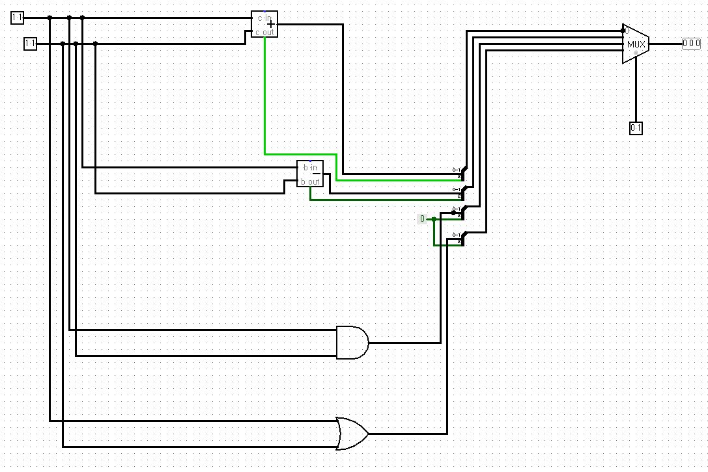
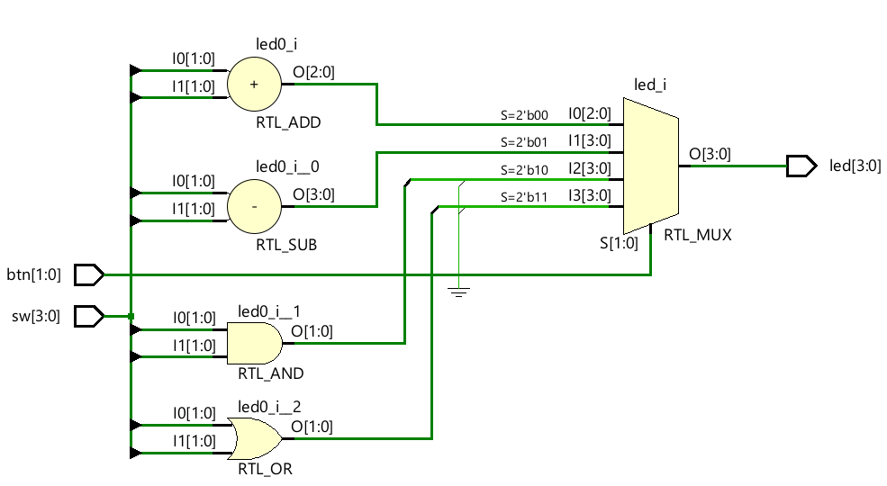
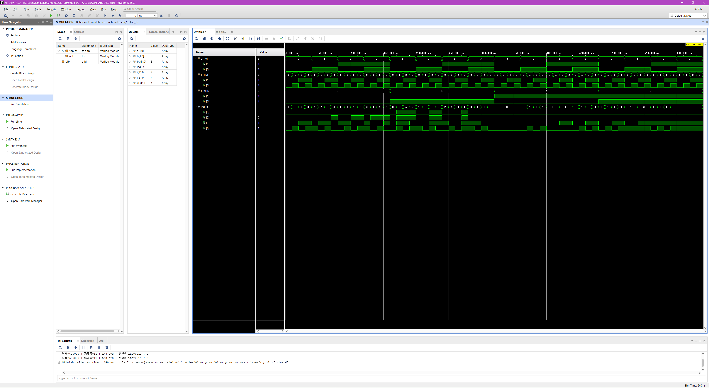

# 🚀 2-bit ALU Implementation on Arty A7 FPGA

This project implements a simple **2-bit Arithmetic Logic Unit (ALU)** using Verilog and Vivado. It performs basic arithmetic and logical operations, and the results are displayed via onboard LEDs on the Digilent Arty A7-35T board.

이 프로젝트는 Vivado와 Verilog를 사용하여 **2비트 산술 논리 연산 장치(ALU)**를 구현한 프로젝트입니다. 기본적인 산술 연산과 논리 연산을 수행하며, 결과는 Arty A7-35T 보드의 LED를 통해 실시간으로 확인할 수 있습니다.

---

## 🎯 Project Goal / 프로젝트 목표

- **Understand the fundamental structure** of an Arithmetic Logic Unit (ALU).
- **Implement Combinational Logic** using Verilog `always @(*)` blocks and `case` statements.
- **Master the full FPGA design flow**: Design -> Simulation -> Synthesis -> Implementation -> Bitstream Generation.

- **ALU(산술 논리 장치)**의 기본적인 구조와 동작 원리를 이해합니다.
- Verilog의 `always @(*)` 블록과 `case` 문을 사용하여 **조합 논리 회로**를 구현합니다.
- **FPGA 설계의 전체 프로세스** (설계, 시뮬레이션, 합성, 구현, 비트스트림 생성)를 숙달합니다.

---

## 🛠 Features & Operations / 주요 기능 및 연산

The ALU takes two 2-bit inputs ($A$ and $B$) and performs one of the following operations based on the button inputs:
ALU는 두 개의 2비트 입력($A$, $B$)을 받아 버튼 입력에 따라 다음과 같은 연산을 수행합니다.

| Button [1:0] | Operation | Description (English) | 설명 (한글) |
| :--- | :---: | :--- | :--- |
| `00` | **ADD** | A + B (Includes Carry) | 덧셈 (올림수 포함) |
| `01` | **SUB** | A - B (Two's Complement) | 뺄셈 (2의 보수 방식) |
| `10` | **AND** | Bitwise AND | 비트 단위 AND 연산 |
| `11` | **OR** | Bitwise OR | 비트 단위 OR 연산 |

---

## 🧩 Architecture / 하드웨어 구조

The design consists of a top-level module that wires switches (inputs), buttons (selectors), and LEDs (outputs).
본 설계는 스위치(입력), 버튼(선택), LED(출력)를 연결하는 최상위 모듈로 구성됩니다.

- **Inputs:** 4 Switches (`sw[3:0]`) are used for operands $A$ and $B$.
- **Selector:** 2 Buttons (`btn[1:0]`) are used for operation selection.
- **Output:** 4 LEDs (`led[3:0]`) display the result (including sign extension for negative results in subtraction).

- **입력:** 4개의 스위치(`sw[3:0]`)를 사용하여 피연산자 $A$와 $B$를 입력합니다.
- **선택:** 2개의 버튼(`btn[1:0]`)으로 연산 종류를 선택합니다.
- **출력:** 4개의 LED(`led[3:0]`)로 결과를 표시합니다. (뺄셈 시 음수 표현을 위한 부호 확장 포함)

- Before implementation, I tried representing the code generated by the AI with logic gates myself.
- Implementation을 하기 전에 AI가 짜준 코드를 직접 로직게이트로 표현해봤습니다

- After Implementation
- Implementation을 한 뒤

---

## 🧪 Simulation Results / 시뮬레이션 결과

- The design was verified using a Verilog **Testbench** with nested loops to cover all 64 possible input combinations. (Powered by Gemini Pro)
- 모든 64가지 입력 조합을 테스트하기 위해 3중 반복문(Nested Loops)을 사용한 **테스트벤치**로 설계를 검증했습니다. 

---

## 📸 Hardware Demo / 하드웨어 작동 모습
[[Add]](./media/Add.mp4)
<video src="./media/Add.mp4" controls width="100%"></video>
[[Substract]](./media/Substract.mp4)
<video src="./media/Substract.mp4" controls width="100%"></video>
[[AND_and_OR]](./media/AND_and_OR.mp4)
<video src="./media/AND_and_OR.mp4" controls width="100%"></video>

## 🔧 Used Tools / 사용한 툴
- vivado 2025.2
- Visual Studio Code
- logisim
- Arty A7-35T FPGA Board

Thank You For Watching! 💕
봐주셔서 감사합니당! 💕