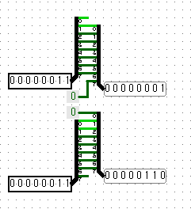
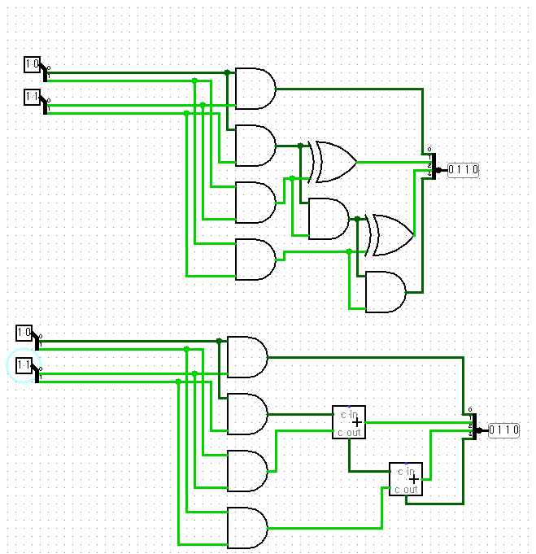
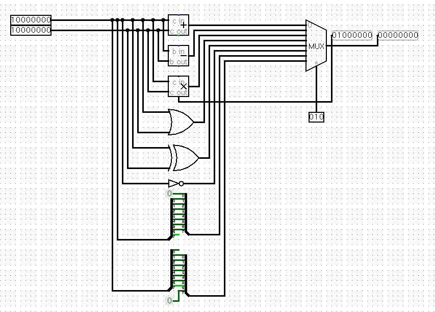
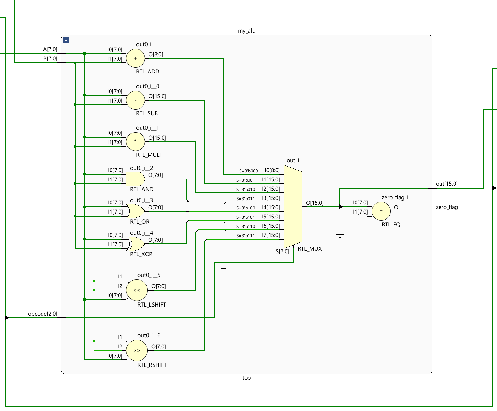
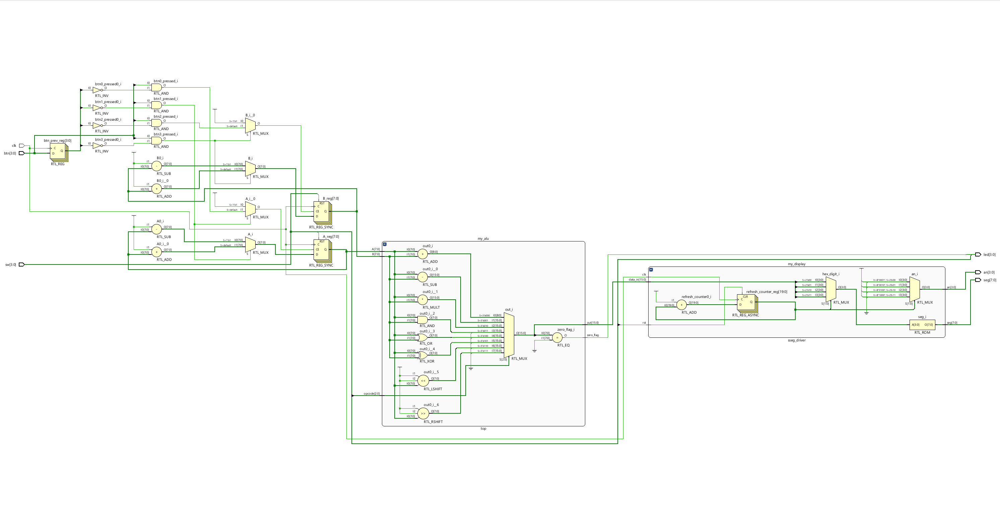

# 💻 8-Bit ALU Implementation on Arty A7-35T

## 📌 Project Overview (프로젝트 소개)

This project is a hardware design project that implements an **8-bit ALU (Arithmetic Logic Unit)** using Verilog directly on the Xilinx Arty A7-35T FPGA board.
Going beyond simple addition/subtraction, it includes an **AMD64-style multiplier** and a **bit shifter**. The calculated 16-bit result is intuitively output in hexadecimal through a dynamically driven 4-digit 7-segment display (3641BS).

이 프로젝트는 Verilog를 이용하여 **8비트 ALU(산술논리연산장치)**를 설계하고, Xilinx Arty A7-35T FPGA 보드에 직접 구현한 하드웨어 설계 프로젝트입니다.
단순한 덧셈/뺄셈을 넘어 **AMD64 스타일의 곱셈기**와 **비트 쉬프터**를 포함하고 있으며, 연산된 16비트 결과값은 다이나믹 구동 방식의 4-digit 7-segment (3641BS)를 통해 16진수로 직관적으로 출력됩니다.

---

## 🛠️ 1. Multiplier & Bit Shifter Design (회로 설계)

This is the logic circuit design background for the core multiplier and bit shifter.
To receive 8-bit inputs (`A`, `B`) and output a 16-bit result, we designed how the bits are extended and processed internally.

가장 핵심이 되는 곱셈기와 비트 쉬프터의 논리 회로 설계 배경입니다.
8비트 입력(`A`, `B`)을 받아 16비트 결과를 출력하기 위해, 내부적으로 어떻게 비트가 확장되고 처리되는지 구상했습니다.

_Bit Shifter Design (비트 쉬프터 설계)_

_Multiplier Design (곱셈기 설계)_

---

## 📐 2. Logisim ALU Architecture (논리 회로 시뮬레이션)

Before Verilog coding, the overall gate-level architecture of the ALU was verified using Logisim. You can visually see how the calculation results are routed according to the Opcode through the MUX.

Verilog 코딩 전, Logisim을 활용하여 ALU의 전체적인 게이트 레벨 아키텍처를 검증했습니다. MUX를 통해 Opcode에 따라 연산 결과가 어떻게 라우팅되는지 시각적으로 확인할 수 있습니다.

_Logisim ALU Architecture_

---

## 🔍 3. Vivado RTL Schematics (RTL 다이어그램)

### 🔹 ALU Core Module (`alu_8bit.v`)

This is the synthesis result of the core module that purely performs arithmetic and logic operations.
순수하게 산술/논리 연산을 수행하는 코어 모듈의 합성 결과입니다.

_ALU RTL Diagram_

### 🔹 Top Module Full Architecture (`top_module.v`)

Centered around the ALU core, this is the entire system diagram combining the button debouncing circuit, switch input section, and the 7-segment display driver (`sseg_driver.v`).
ALU 코어를 중심으로, 버튼 디바운싱 회로, 스위치 입력부, 그리고 7-segment 디스플레이 드라이버(`sseg_driver.v`)가 모두 결합된 전체 시스템 다이어그램입니다.

_FULL ALU RTL Diagram_

---

## 📈 4. Simulation Results (테스트벤치 검증)

This is the Waveform result of `top_tb.v` simulated using Vivado Simulator.
We confirmed that addition, subtraction, and logic operations, **especially the maximum value operation (`0xFF * 0xFF = 0xFE01`)**, are accurately performed in sync with the clock.

Vivado Simulator를 이용해 작성한 `top_tb.v`의 Waveform 결과입니다.
**특히 최댓값 연산(`0xFF * 0xFF = 0xFE01`)**을 포함하여 덧셈, 뺄셈, 논리 연산이 클럭에 맞춰 정확하게 수행되는 것을 확인했습니다.

_Simulation Result_

---

## 🚀 5. Hardware Demonstration (실제 구동 영상)

This is the actual test video of running the bitstream on the Arty A7 board.
By changing the Opcode through switch (`sw[2:0]`) manipulation and adjusting the input values `A` and `B` with buttons, the calculation result is immediately reflected on the 7-segment display.

Arty A7 보드에 비트스트림을 올리고 구동하는 실제 테스트 영상입니다.
스위치(`sw[2:0]`) 조작을 통해 Opcode를 변경하고, 버튼으로 입력값 `A`와 `B`를 조절할 때마다 7-segment에 즉각적으로 연산 결과가 반영됩니다.

[[Add]](./media/Add.mp4)
<video src="./media/Add.mp4" controls width="100%"></video>
`0x0005 + 0x0005 = 0x000A`

[[Subtract]](./media/Sub.mp4)
<video src="./media/Sub.mp4" controls width="100%"></video>
`0x000A - 0x0005 = 0x0005`

[[Left Shift]](./media/L.mp4)
<video src="./media/L.mp4" controls width="100%"></video>
`0x000F -> 0x001E`

[[Right Shift]](./media/R.mp4)
<video src="./media/R.mp4" controls width="100%"></video>
`0x000F -> 0x0007`

[[Multiply]](./media/Mul.mp4)
<video src="./media/Mul.mp4" controls width="100%"></video>
`(0x00FF + 0x00FF = 0x01FE)`  
`0x00FF * 0x00FF = 0xFE01`

[[AND]](./media/And.mp4)
<video src="./media/And.mp4" controls width="100%"></video>
`(0x00FF + 0x00FF = 0x01FE)`  
`0x00FF & 0x00FF = 0x00FF`

[[XOR]](./media/Xor.mp4)
<video src="./media/Xor.mp4" controls width="100%"></video>
`0x000F ^ 0x0001 = 0x000E`

---

## 💡 6. Trouble Shooting & Lessons Learned (이슈 및 해결)

These are the main hardware debugging experiences encountered during this project.
이번 프로젝트를 진행하며 맞닥뜨린 주요 하드웨어 디버깅 경험입니다.

- **"Curse of the Name Tag" (Vivado Top Module Setting Issue):** When the sub-module name was `top`, even if the Top Module was forcibly designated in the GUI, the synthesis engine was confused and failed to map the clock pin. This was resolved by clearly separating the module names (e.g., `alu_8bit`).
- **"이름표의 저주" (Vivado Top Module 설정 이슈):** 하위 모듈의 이름이 `top`으로 되어 있을 때, GUI에서 Top Module을 강제로 지정해도 합성 엔진이 헷갈려 클럭 핀을 매핑하지 못하는 문제를 겪었습니다. 모듈 이름을 명확히(`alu_8bit`) 분리하여 해결했습니다.

- **Bitstream Encryption Trap:** If the `.nky` encryption option is turned on in the XDC file or project settings, the board refuses to boot (Startup) and faints unless the key is burned into BBR or eFUSE. We successfully debugged this `End of startup status: LOW` phenomenon.
- **비트스트림 암호화(Encryption) 함정:** XDC 파일이나 프로젝트 설정에 `.nky` 암호화 옵션이 켜져 있으면, BBR이나 eFUSE에 키를 굽지 않는 이상 보드가 부팅(Startup)을 거부하고 기절하는 현상을 디버깅했습니다.
